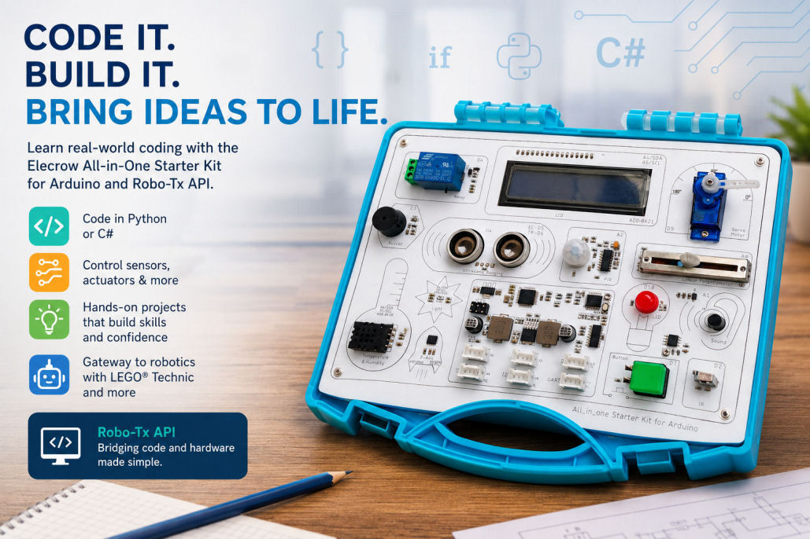

# Python Programming: Robotics Foundation Course — Student Resources

This repository contains the files required to complete the practical tasks and exercises in the [**Python Programming: Robotics Foundation Course**](https://www.cohesivecomputing.co.uk/python-programming-robotics-foundation-course/).

The course combines Python programming with practical core robotics activities, allowing students to develop and reinforce programming skills by writing software that interacts with real sensors, displays, motors, LEDs and other electronic components.

## About the Course

The course is designed to provide a practical foundation in Python programming through a series of progressively more challenging exercises and projects.

Rather than concentrating solely on programming examples in isolation, the course uses robotics hardware (sensors and actuators) to give Python programs a real-world purpose. Students learn to develop, test and improve programs that interact with physical devices.

The course is based on the **Elecrow All-in-One Starter Kit for Arduino**, together with the Robo-Tx firmware and API used to communicate with the hardware from Python.

Students **do not need to own the Elecrow All-in-One Starter Kit** to participate in the course. During supervised sessions, students can access the hardware remotely and run their programs against the remotely accessible kit.

Students who own the hardware can alternatively set up their own PC and All-in-One Starter Kit to run the exercises locally.

## What's in this Repository?

The repository contains several types of files.

### Python Exercise Template

A reusable Python template is provided for coding exercises. The template establishes the basic structure needed to communicate with the Elecrow All-in-One Starter Kit and provides a starting point from which students can implement their solutions.

For most coding exercises, students should make a copy of the template rather than modifying the original template. The variable *serial_port* in the app_config.py file will need to be set to the name of the serial port which is used by the All-in-One kit when it is connected to the computer. On Windows, this can be found under *ports* using the Device Manager control panel app.

### Basic Python Examples

The repository contains small Python programs demonstrating individual programming concepts and features of the Robo-Tx API.

These examples are intended to help students:

* understand how Python interacts with the Robo-Tx firmware on robotics hardware;
* see programming concepts applied to practical problems;
* experiment with sensors and actuators; and
* refer back to working examples when solving later challenges.

The examples are deliberately straightforward and students are encouraged to study how they work.

### Complete Projects

Some exercises are supplied as **complete working applications** rather than programs that students must initially write from scratch.

These projects provide a working starting point for more advanced programming activities. Students are asked to understand the existing program and then extend, adapt or improve it to satisfy new requirements.

This approach provides an opportunity to practise skills such as:

* reading and understanding existing Python code;
* identifying how different parts of a program work together;
* modifying existing functions and statements;
* adding new functionality;
* testing changes;
* locating and fixing bugs; and
* making changes without breaking existing functionality.

The ability to modify and maintain an existing program is an important programming skill and complements the experience gained from writing programs from scratch.

## Hardware

The course uses the **Elecrow All-in-One Starter Kit for Arduino** as its robotics learning platform.

The kit provides a collection of sensors, actuators, controls and display that can be accessed from Python through the Robo-Tx API. This allows programming concepts to be demonstrated using tangible, interactive applications rather than purely console-based programs.

### You Don't Need the Hardware

Students participating in the course do **not** need to purchase the All-in-One Starter Kit.

The course is designed to support remote access to the hardware during supervised course sessions. This means that students can develop and test their Python programs without having the physical electronics connected to their own computer.

### Using Your Own Kit?

Students who already have an Elecrow All-in-One Starter Kit can configure their own computer and hardware to run the examples locally. [**Instructions**](#computer-and-hardware-configuration) for doing can be found towards the end of this README.

## Working Through the Exercises

The repository files are intended to be used alongside the course material rather than as a standalone collection of programs.

When completing an exercise, students should follow the instructions provided by the course and use the appropriate repository file as their starting point.

Depending on the exercise, the student may be asked to:

* write a program from scratch;
* add a new feature;
* change the way a sensor or actuator is used;
* find and fix a programming error; or
* combine several programming techniques in a larger application.

Students are encouraged to experiment with the programs rather than simply copying solutions. Changing values, testing different conditions and observing the effect on the hardware are important parts of learning to program.

Students should regularly attend an online supervised practical session to receive support if needed, demonstrate their work, discuss their approach and be briefed for the next assignment.

---

## Computer and Hardware Configuration

For students who have and want to use their own Elecrow All-in-One Starter Kit for Arduino, follow the instructions here to configure it and your computing environment. It is only necessary to install software if not already installed.

### 1. Install Robo-Tx Firmware on the All-in-One Starter Kit for Arduino

You must first deploy the firmware:

* Install [Arduino IDE](https://www.arduino.cc/en/software) on your computer;
* Download and unzip [RoboTx_Firmware](https://github.com/kashif-baig/RoboTx_Firmware);
* Locate the .ino file in the unzipped folder and open it using the Arduino IDE;
* Make sure the All-in-One kit is connected to the computer's USB port;
* In the Arduino IDE, select the *Arduino Uno* as the board, making sure that it shows as connected to the correct USB port;
* Upload the firmware using the Arduino IDE.

This firmware enables communication between the user's computer and the Arduino.

---

### 2. Install .NET Runtime

* Install [**.NET 8.0 or later**](https://dotnet.microsoft.com/en-us/download) on to your computer.

This is required for running your Python programs with the API that communicates with the Robo-Tx firmware.

---

### 3. Install Powershell

* Install [Powershell](https://learn.microsoft.com/en-us/powershell/scripting/install/install-powershell-on-windows?view=powershell-7.6) if not already installed on your computer.

This is needed for running scripts to configure your Python environment.

---

### 4. Python Setup

To run Python examples:

* Install [**Python (≤ 3.14)**](https://www.python.org/downloads/).

Please note the version number of your Python installation.

---

### 5. Install Visual Studio Code (VS Code)

It is strongly recommended to install and use VS Code for Python development:

* Install [Visual Studio Code](https://code.visualstudio.com/download);
* Install [Python](https://marketplace.visualstudio.com/items?itemName=ms-python.python) and [Pylance](https://marketplace.visualstudio.com/items?itemName=ms-python.vscode-pylance) extensions.

#### Why Visual Studio Code?

Visual Studio Code is ideal because:

* Lightweight and fast
* Excellent support for Python
* Integrated terminal
* Rich extension ecosystem

---

## Running the Python Code

After the computing environment and Elecrow All-in-One Starter kit have been configured, download this repo and create a Python virtual environment for it using the steps below.

* Download the ZIP for this repo and extract to a folder on your computer;
* In the extracted folder, locate the Powershell script *create-venv.ps1* and open using Visual Studio Code. This is needed to create a Python virtual environment and install the package [Pythonnet]((https://pypi.org/project/pythonnet/));
* Run this script by clicking the Run icon, usually at the top right of the VS Code window. If it fails, try running it again.

Once all the steps have been successfully completed, the computing environment will be ready for developing and running Python programs against the Elecrow All-in-One Starter kit.

To run a particular Python example from the repo:

* Open the extracted folder using Visual Studio Code;
* Set the variable *serial_port* in file *app_config.py* to the serial port the All-in-One kit is connected to;
* Select the Python file of interest and click the Run icon.

---

## Licence and Educational Use

The contents of this repository are provided for use in conjunction with the Python Programming: Robotics Foundation Course.

Students are encouraged to experiment with, modify and extend the example programs as part of their learning.
